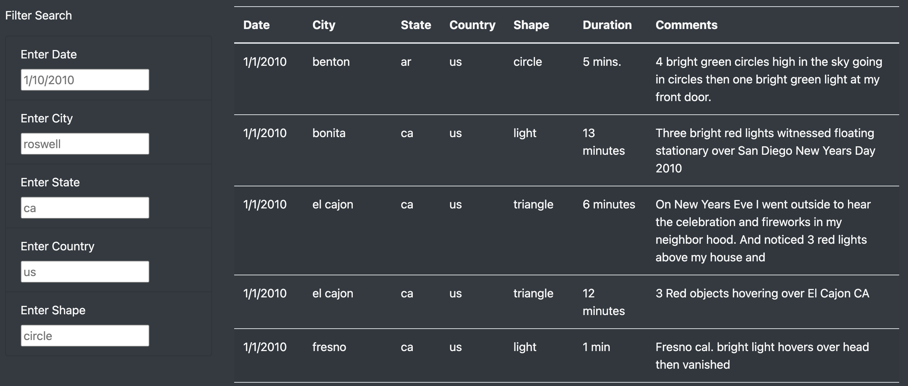
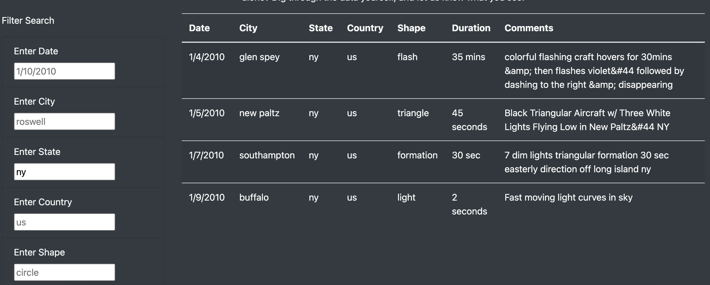

# UFOs

## Overview of Analysis
This analysis was intended to produce an interactive webpage with tables that filter the results of UFO sightings data. Originally, this webpage was only created with a date filter. However, this project also supplied filters for state, city, country, and shape to give users additional options for how to filter this data.  

## Results
The filter tool on this webpage is a fairly straightforward process. This filter tool previously only gave the option to filter by date, which would be accomplished by simply inputting a date in the 'mm/dd/yyyy' format. This search would bring up all results reported from the exact date entered. After adding the extra filters, we can also filter data by state, country, city and shape. The grayed out placeholders shown below are meant to demonstrate how to properly format each filter search. For example, when searching a state, you would have to use the lowercase state abbreviation. Searching "New York" or "NY" to find results from New York would not yield any results. When the user correctly inputs a filter, the table will update automatically (as shown below). 

